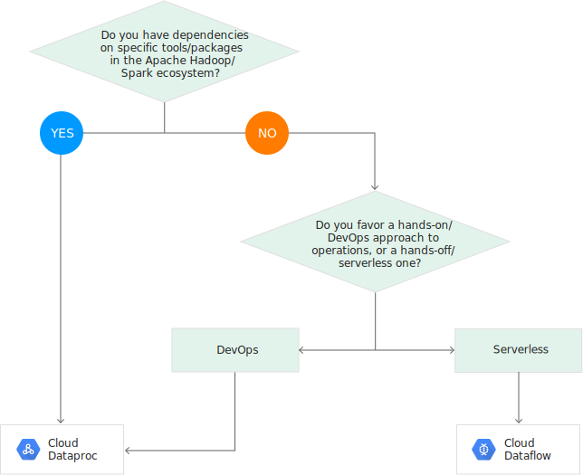

# Dataproc

- Managed Hadoop (Spark, SparkML, Hive, Pig, etc…)
- Automated cluster management, resizing
- Code/Query only
- Job management screen in the console
- Think in terms of a ‘job specific resource’ – for each job, create a cluster and then delete it.
- Used if **migrating existing on-premise Hadoop or Spark infrastructure** to GCP without redevelopment effort.
- Can sale even when jobs are running.
- Use Dataflow for streaming instead. **This is better for batch.**

    

- Connecting to Web Interface of Dataproc Cluster
    - Allow necessary web ports access via firewall rules, and limit access to your network.
        - Tcp:8088 (Cluster Manager)
            - <Master Node IP>:8088
        - Tcp:50070 (Connect to HDFS name node)
            - <Master Node IP>:50070
    - OR SOCKS proxy (routes through an SSH tunnel for secure access)
        - gcloud compute ssh [master_node_name]

## Cost
- Standard Compute Engine machine type pricing + managed Dataproc premium.
- Premium = $0.01 per vCPU core/hour
- Billed by the second, with a minimum of 1 minute.

## Storage
- Can use on disk (HDFS) or GCS
### HDFS
- Split up on the cluster, but requires cluster to be up.
### GCS
- Allows for the use of preemptible machines that can reduce costs significantly.
    - DO not need to configure startup and shutdown scripts to gracefully handle shutdown, Dataproc already handles this.
    - Cluster MUST have at least 2 standard worker nodes however.
- Separate cluster and storage.
- Cloud Storage Connector
    - Allows you to run Hadoop or Spark jobs directly on GCS.
    - Quick startup
        - In HDFS, a MapReduce job can’t start until the NameNode is out of safe mode.
        - With GCS, can start job as soon as the task nodes start, leading to significant cost savings over time.
-------------

- Cluster Machine Types
    - Build using Compute Engine VM instances
    - Cluster – need at least 1 master and 2 workers

- High Availability Mode
    - 3 masters rather than 1
    - 3 masters run in an Apache Zookeeper cluster for automatic failover.

- Restartable Jobs
    - Jobs do NOT restart on failure (default)
    - Can change this – useful for long running and streaming jobs (ex. Spark Streaming)
    - Mitigates out-of-memory errors, unscheduled reboots

## Updating Clusters
- Can only change # workers/preemptible VM’s/labels/toggle graceful decommission.
    - Graceful Decommissioning
        - Finish work in progress on a worker before it is removed from Dataproc cluster.
        - Incorporates graceful YARN decommissioning.
        - May fail for preemptible workers.
            - Can forcefully decommission preemptible workers at any time.
        - Will always work with primary workers.
        - gcloud dataproc clusters update –gracefult-decommission-timeout
            - Default to “0s” – forceful decommissioning.
            - Need to provide a time.
            - Max value 1 day.
    - Automatically reshards data for you.

## Migrating and Optimizing for GCP Best Practices
- Move data first
    - Generally to GCS buckets.
    - Possible exceptions
        - Apache HBase data to BigTable
        - Apache Impala to BigQuery
        - Can still choose to move to GCS if BigTable/BQ feature not needed.
- Small scale experimentation
    - Use a subset of data to test.
- Think of it in terms of ephemeral clusters.
- Use GCP tools to optimize and save costs.

## Converting from HDFS to GCS
- Copy data to GCS
    - Install connector or copy manually
- Update file prefix in scripts
    - Hdfs:// to gs://
- Use Dataproc, and run against/output to GCS

## Connectors
- BQ/BigTable (copies data to GCS) /CloudStorage

## Optional Components
- Anaconda, Druid
- Hive WebHCat
- Jupyter
- Kerberos
- Presto
- Zeppelin
- Zookeeper
--------------

- How to configure Hadoop to use all cores?
    - Think spark executor cores
- How to handle out of memory errors?
    - Hint - Executor memory
- How to install other components?
    - Hint – Initialization actions

## IAM
- Project level only (primitive and predefined roles)
- Cloud Dataproc Editor, Viewer, and Worker
    - Editor – Full access to create/edit/delete clusters/jobs/workflows
    - Viewer – View access only
    - Worker – Assigned to service accounts
        - Read/write GCS, write to Cloud Logging